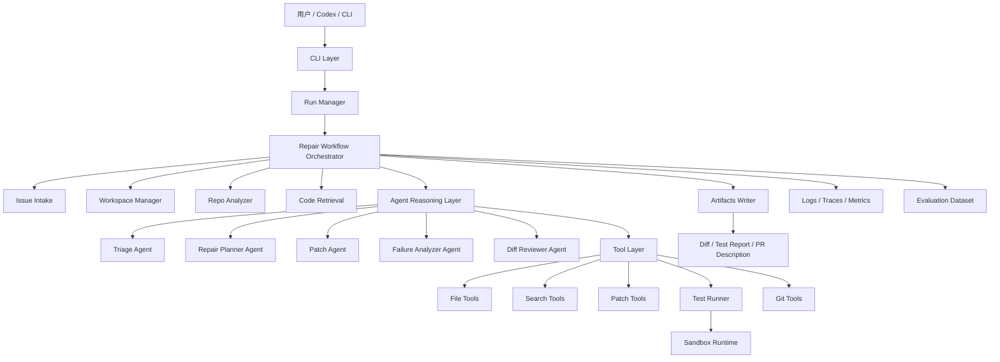

# RepoPilot Architecture

## System Intent
RepoPilot is an issue-driven code repair agent for GitHub repositories. It is a controlled engineering workflow that can later use LLM reasoning, tools, sandboxed execution, and GitHub APIs under explicit permission boundaries.

## Layered Flow

## Layer Responsibilities
- CLI/API layer receives user input and starts runs. It must not directly patch files or call GitHub writes.
- Run Manager owns run ids, status, timestamps, approval state, and artifact references.
- Repair Workflow Orchestrator coordinates stages and records state transitions. It is deterministic workflow code, not an autonomous model loop.
- Issue Intake normalizes raw bug text, GitHub Issue URLs, and fixture-backed GitHub issue payloads.
- Workspace Manager prepares a local or future cloned workspace. A02 provides only local/noop contracts.
- Repo Analyzer and Code Retrieval build searchable context for planning. F02 will expand this layer.
- Agent Reasoning Layer contains bounded triage, planning, patch proposal, failure analysis, and review decisions.
- Tool Layer exposes file, search, patch, test, and git tools through structured result contracts.
- Sandbox Runtime is the only future path for command/test execution.
- Artifacts Writer produces diff, test report, risk assessment, and PR description bundles.
- Observability records workflow, tool, model, test, and approval events.
- Evaluation stores golden cases and regression metrics.

## Runtime Entrypoints
- CLI: `python scripts/repopilot.py --help`
- API: `uvicorn repopilot.main:app --reload`
- Complete validation: `python scripts/check.py`

## A02 Boundaries
A02 adds contracts and noop implementations only. It must not:
- clone repositories,
- modify files,
- run tests or shell commands,
- call GitHub,
- call OpenAI or other model providers,
- create branches, commits, PRs, or comments.

Future features should replace noop boundaries one subsystem at a time with tests and approval rules.
